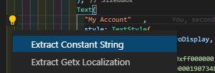

# flutter-strings-extract 
```This extension is still under development, errors may occur and  welcome your contributions```

it's vs code extension "flutter-strings-extract". help you to extract static string  in widget flutter  to  constant string file or  getx localization file 




## How its Work
### Extract Constant String

 extract any string  in  widgets flutter  to constant class `Strings` in lib\resource\strings.dart
    for example

  ```dart
         Text( "My Account"   ,
                    style: TextStyle(
                      fontSize: 25,
                    ),),
 ```

to 

  ```dart
         Text(Strings.MyAccount   ,
                    style: TextStyle(
                      fontSize: 25,
                    ),),
 ```


### Extract to getx localization  

 extract any string  in  widgets flutter  to map `enUS`  lib\localization\lang\en_us.dart
    for example

  ```dart
         Text( "My Account"   ,
                    style: TextStyle(
                      fontSize: 25,
                    ),),
 ```

to 

  ```dart
         Text("MyAccount".tr   ,
                    style: TextStyle(
                      fontSize: 25,
                    ),),
 ```


**Enjoy!**
